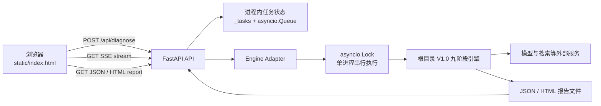

# GEO 可见度诊断师 V1.5 SDD（技术设计说明）

> 文档基线：2026-07-18
> 版本：V1.5.0
> 代码范围：发布主仓库 `geo-visibility-diagnosticia-publish` 的 `v1.5/`，以及仓库根目录冻结的 V1.0 诊断引擎。
> 当前状态：节点 4 的 SSE 修复、节点 5 的桌面/手机/T+24 复测及节点 6 的证据回填均已完成；V1.5 发布验收通过。

## 1. 目的与边界

V1.5 是对既有 GEO 可见度诊断引擎的 Web 化交付层：用户在浏览器提交品牌诊断请求，服务端调用 V1.0 九阶段引擎，并以 SSE 持续反馈进度，最终提供 JSON 与 HTML 报告。

V1.5 不重写、不改变 V1.0 的诊断算法、评分口径和九阶段顺序。它负责 API、任务编排、进度流、浏览器交互、部署与验收证据；诊断结论仍由根目录 V1.0 引擎产出。

本 SDD 描述当前实现与明确的运行边界，不替代产品需求。产品目标、用户体验与成功指标见 [PRD.md](PRD.md)。

## 2. 文档职责与依据

| 文档 / 代码 | 在本项目中的职责 |
| --- | --- |
| [PRD.md](PRD.md) | 产品目标、用户流程、非目标与体验要求 |
| 本文档 | 已实现的技术方案、接口、运行边界和技术风险 |
| [plan.md](plan.md) | 当前任务状态的唯一来源 |
| [ACCEPTANCE.md](ACCEPTANCE.md) | 验收证据与未通过项的唯一来源 |
| [NODE4_EXECUTION.md](NODE4_EXECUTION.md) | 节点 4 的修复与生产复测历史 |
| [NODE5_EXECUTION.md](NODE5_EXECUTION.md) | 跨设备与 24 小时稳定性执行证据 |
| [ISSUE_BACKLOG.md](ISSUE_BACKLOG.md) | 不阻断本次发布的风险、技术债与后续分诊入口 |
| [DEPLOYMENT.md](DEPLOYMENT.md) | 本地、Docker、Render 的操作说明 |
| `main.py`、`stages/`、`report/` | 冻结的 V1.0 诊断引擎实现 |
| `v1.5/src/`、`v1.5/static/` | V1.5 当前实现的最终技术事实 |

发生冲突时，以可运行代码和验收证据为准；需要改变产品范围时先更新 PRD，需要改变已确认技术方案时同步更新本文与相应验收记录。

## 3. 系统架构

### 3.1 组件职责

| 组件 | 位置 | 职责 |
| --- | --- | --- |
| Web UI | `v1.5/static/` | 提交品牌、展示阶段和查询进度、接收 SSE，并在连接异常时读取任务状态恢复展示。 |
| FastAPI 服务 | `v1.5/src/api.py` | 提供静态资源、诊断创建、SSE、状态查询、JSON/HTML 报告和健康检查。 |
| 任务状态层 | `v1.5/src/api.py` 的 `_tasks` | 保存单次任务的状态、阶段、SSE 队列、结果路径和错误信息。仅驻留当前服务进程内。 |
| 引擎适配层 | `v1.5/src/engine_adapter.py` | 将 V1.5 的异步进度回调转换为 V1.0 引擎调用，校验 `GEO_ENGINE_ROOT`，并限制并发。 |
| V1.0 引擎 | 根目录 `main.py`、`stages/` 等 | 执行九阶段诊断，调用既有模型/搜索能力，写出 JSON 与 HTML 报告。 |
| 部署镜像 | `v1.5/Dockerfile` | 同时复制根目录引擎与 V1.5 Web 层，以 Docker 容器运行 Uvicorn。 |

## 4. 诊断与数据流

1. 浏览器调用 `POST /api/diagnose`，提交品牌、品类、官网和模型平台等输入。
2. API 创建 `task_id`，初始化内存任务状态和 `asyncio.Queue`，立即返回任务标识；后台协程执行实际诊断。
3. 引擎适配层使用全局 `asyncio.Lock` 进入 V1.0 引擎，确保单个服务进程内一次只运行一个真实诊断。
4. V1.0 引擎按固定九阶段运行：阶段 1；阶段 2、3 并行；阶段 4；阶段 5、6 并行；阶段 7、8、9。
5. 阶段开始、完成及阶段 4 的查询进度写入任务状态和 SSE 队列；未产生业务进度时，服务端定期写入心跳事件，避免长搜索期间被中间网络层判定为空闲。
6. 引擎完成后返回报告对象与 JSON/HTML 路径。API 标记任务 `success`，发送 `complete`；失败时记录错误并发送 `error`。
7. 浏览器通过报告接口读取成功任务的 JSON 或 HTML 文件；如果 SSE 暂时断开，前端通过任务状态接口恢复当前展示。

### 4.1 九阶段引擎边界

V1.5 只观察并转发引擎进度，不在 API 层重算评分、替换阶段或篡改报告。进度回调是可观测性通道，不应因为界面或 SSE 的异常而中断诊断主流程。

## 5. API 与事件契约

### 5.1 HTTP 接口

| 接口 | 用途 | 关键返回 / 限制 |
| --- | --- | --- |
| `GET /health` | 部署健康检查 | 返回服务状态与版本；Render 健康检查使用该接口。 |
| `POST /api/diagnose` | 创建诊断任务 | 返回 `task_id`、初始状态和预计时长；实际诊断在后台执行。 |
| `GET /api/diagnose/{task_id}` | 查询任务状态 | 返回状态、进度、阶段、AIVO 分数、错误与阶段 4 查询进度。 |
| `GET /api/diagnose/{task_id}/stream` | 接收进度事件 | `text/event-stream`；任务不存在时返回 404。 |
| `GET /api/diagnose/{task_id}/report` | 读取 JSON 报告 | 仅成功任务可读取。 |
| `GET /api/diagnose/{task_id}/report/html` | 读取 HTML 报告 | 仅成功任务且报告文件存在时可读取。 |
| `GET /` | Web 页面 | 同源静态页面入口。 |

`POST /api/diagnose` 的请求字段由当前前端与 `api.py` 共同定义：`brand`、`category`、可选 `website`、`platform`。服务端会拒绝缺失必填字段或不支持的平台。

### 5.2 SSE 事件

| 事件 | 含义 | 消费方行为 |
| --- | --- | --- |
| `start` | 后台任务已启动 | 初始化进度界面。 |
| `stage_start` | 一个诊断阶段开始 | 标记当前阶段。 |
| `stage_complete` | 一个诊断阶段完成 | 更新阶段完成数；前端按唯一阶段计数，避免重复事件造成超计数。 |
| `search_progress` | 阶段 4 单个查询完成 | 显示已完成查询数和总查询数。 |
| `heartbeat` | 长耗时期间的保活事件 | 保持 SSE 连接，不改变业务进度。 |
| `complete` | 诊断和报告写入成功 | 进入结果展示，并允许读取两类报告。 |
| `error` | 诊断失败 | 展示可读错误，保留任务状态供排查。 |

## 6. 任务状态、并发与恢复

任务状态包含 `pending`、`running`、`success`、`error` 等运行信息，以及阶段进度、查询进度、结果路径和错误内容。状态保存在 `_tasks` 内存字典，SSE 使用每个任务自己的 `asyncio.Queue`。

这带来以下明确边界：

- 服务重启、实例替换或多实例路由后，内存任务与未读 SSE 事件不会持久化；本版本没有 Redis、数据库或跨实例任务队列。
- `_engine_lock` 令单个进程中的诊断串行执行。它保护现有 V1.0 引擎的共享运行条件，但高峰期后续请求需要等待，并非多租户并行计算方案。
- SSE 是展示通道，不是诊断完成的唯一判据；任务状态与最终 JSON/HTML 报告才是结果读取依据。
- 前端已具备断流后的状态查询恢复路径；节点 4 仍需在公网环境验证完整 SSE 链路。

## 7. 配置、安全与外部依赖

### 7.1 环境变量

| 配置 | 用途 |
| --- | --- |
| `GEO_ENGINE_ROOT` | V1.0 引擎根目录；容器中指向 `/app/engine`。 |
| `CORS_ALLOW_ORIGINS` | 允许访问 API 的浏览器来源；生产环境应限定为实际域名。 |
| `SSE_HEARTBEAT_SECONDS` | SSE 空闲心跳间隔；默认 15 秒，服务端最小值为 5 秒。 |
| `KIMI_API_KEY`、`KIMI_API_URL`、`KIMI_MODEL` | Moonshot/Kimi 调用配置。 |
| `DOUBAO_API_KEY` 及其他可选 Provider 配置 | V1.0 引擎对应的模型或检索能力配置。 |

密钥只在 Render 等部署平台的环境变量中配置，禁止写入代码、Git 仓库、SDD、验收记录或截图。环境变量名称与完整部署操作见 [DEPLOYMENT.md](DEPLOYMENT.md)。

### 7.2 模型路由

V1.5 将模型平台选择传给既有引擎。当前已有针对 Kimi-only 路由的回归测试，避免在仅配置 Kimi 时错误调用其他 Provider。具体 Prompt、模型策略和诊断方法属于 V1.0 引擎实现，不在 Web 层复制一份。

## 8. 构建与部署

Render 使用根目录作为 Docker build context，以便镜像同时获得 V1.0 引擎和 `v1.5` Web 层；`v1.5/Dockerfile` 以 Python 3.12 运行 Uvicorn，服务端口由 `PORT` 适配平台。

部署变更必须按以下顺序验证：

1. 本地运行相关测试与静态检查。
2. 合并或部署到 Render 后，确认 `GET /health`。
3. 使用真实品牌执行一次诊断，验证从 `start` 到 `complete` 的 SSE、JSON 报告和 HTML 报告均可访问。
4. 再执行桌面端、手机端走查和 24 小时复测，并把事实填入 [ACCEPTANCE.md](ACCEPTANCE.md)。

代码已推送或 CI 通过仅说明构建链路可用，不等同于公网生产验收通过。

## 9. 测试策略与当前证据

`v1.5/tests/` 覆盖以下关键行为：

- 根路径与健康检查；
- 正常诊断时的九阶段 SSE、查询进度、完成事件与 JSON/HTML 报告读取；
- 长耗时任务的心跳事件；
- 引擎报错时保持 SSE 正常结束并返回错误状态；
- Kimi-only 配置下的正确 Provider 路由。

截至本文基线，PR #5 的 heartbeat、阶段 4 查询进度、前端状态恢复与唯一阶段计数已进入生产。真实品牌任务在公网、桌面、手机 4G 和 T+24 小时复测中均完成九阶段并可读取 JSON/HTML 报告。精确任务 ID、耗时和验收结论以 [ACCEPTANCE.md](ACCEPTANCE.md) 与 [NODE5_EXECUTION.md](NODE5_EXECUTION.md) 为准。

## 10. 已知限制与风险

| 项目 | 当前影响 | 处理原则 |
| --- | --- | --- |
| 阶段 4 外部搜索耗时波动 | 单次诊断可能长于前端的预计时间。 | heartbeat、查询进度和状态恢复已在生产验收中验证；后续继续记录真实耗时。 |
| 进程内任务存储 | 重启后无法恢复任务；无法保证多实例一致性。 | 当前作为单实例交付边界；扩容前需引入持久任务状态。 |
| 单进程串行引擎锁 | 并发用户会排队。 | 在吞吐量成为真实问题前不提前引入队列或分布式架构。 |
| 外部模型与搜索服务 | 可用性、耗时、配额和费用受第三方影响。 | 用真实诊断和 24 小时复测记录实际稳定性，不以模拟测试替代。 |

## 11. 后续维护规则

节点 6 未引入新的接口、架构或配置变更；本次只将运行证据和已知限制更新为已验收状态。

后续若改变接口、架构、配置、部署或运行边界，必须先更新本文与对应验收用例；`plan.md` 继续记录任务状态，`ACCEPTANCE.md` 继续记录验收事实，本文不替代二者。
